# Compilation rules: agent manifest → runtime

*Maintained doc. Extracted July 30, 2026 from the weight-tracker scratch-pad experiments;
the running example throughout is `agents/weight-tracker/manifest.yaml`. These rules are
AXE-level semantics — they apply to any manifest, not just the weight tracker. The
authoring surface these rules consume — what a node and an edge may contain — is
`.agent/fsm-notation.md`.*

The compiler consumes the manifest and emits two runtime artifacts plus one documentation
artifact:

| Source | Target |
|---|---|
| `interaction.fsm` | a **claude-agent-spec**: per-state turn config for the model + a runtime state machine |
| `genui.patterns` | **A2UI JSON** (`createSurface` / `updateComponents` / `updateDataModel`) per state |
| the whole manifest | **`agents/<id>/README.md`**: the human-readable rendering, including a Mermaid diagram of the FSM |

## 1. FSM → claude-agent-spec

**R1 — the edge's tool-use half.** An edge's `do:` compiles to the calls it names, run in
order with the trigger's payload, stopping at the first failure; `do: none` compiles to a
**pure transition** (state/UI change only — e.g. `open_tracker`). When `do:` is omitted the
compiler *infers* it: a trigger whose canonical name matches a declared tool compiles to a
call of that tool (`log_weight(kg)` → `tool log_weight(kg)`), and a name matching no tool
compiles to a pure transition. This is why triggers carry a canonical `name:` alongside the
designer's `desc:` prose — the prose is for the designer, the name is for the compiler. A
`do:` naming a tool absent from `tools:` is an error at the point the edge is taken.

**R2 — per-state agent config.** Each state compiles to the turn config handed to the model
while that state is current:

- *system-prompt fragment*: the state's `desc` + its pattern's `fallback` text;
- *tool allowlist*: only the tools this state's outgoing edges `do:` (weight tracker: only
  s4 and s3 expose `log_weight`, because only edges leaving them write; s2 exposes nothing,
  since its edges route to the check first, and s1 nothing — end state);
- *output contract*: only the content blocks the state's pattern permits.

This is what makes the FSM enforcement rather than suggestion: a state cannot call a tool
or render a component its outgoing edges and pattern don't declare.

**R3 — data refresh.** Entering a state re-materializes every path in its pattern's
`binds:` list (weight tracker: `/trend` recomputes after logging). "Update the chart" is
never authored; it falls out of arriving in a state whose pattern binds the path. The
trigger's payload is then written over the top: each arg lands at the bound path whose last
segment matches its name (`suggested_kg` → `/check/suggested_kg`, `kg` → `/entry/kg`), which
is how a verdict's suggestion reaches the surface that offers it. Payload accumulates across
the hops of one request, so a value entered before a judgment is still there after it.

**R4 — channel split.** `chat:` triggers compile to one intent-classification step by the
model: it maps a free-text message onto an outgoing canonical name, or `none` → stay in
state and let the model respond normally (the no-trap escape hatch). `ui:` triggers bypass
the model entirely — the A2UI event hits the runtime, which executes R1's tool call and
advances the machine deterministically. `agent:` triggers are the mirror of `chat:`: the
model classifies over what the agent knows rather than over a user message, choosing one of
the state's outgoing verdicts, and falling back to the `default: true` verdict when no
answer is available (which must therefore be the cautious branch — N6). The runtime resolves them in the same request that entered the state
(capped at 3 hops), so a judging state never persists between turns and a client can never
send one. **The runtime owns the current state; the model never does.**

**R5 — end states.** `end: true` means the machine is done for this invocation. The surface
persists (stacked above the prompt textbox; chat stays live); a later chat message starts a
new run at `initial`. Persistence belongs to the surface, not the machine.

## 2. Pattern language → A2UI

Five language rules, total:

- **`Component #id`** — a catalog component plus a stable id. Nesting in `layout:` is
  authoring sugar; the compiler flattens it into A2UI's id-referenced flat component list.
- **`@/path`** — a data binding; compiles to `{"path": "/…"}`. `{@/path}` inside a string
  is interpolation.
- **`?ui-state`** — conditional subtree; emitted when the bound UI state is the one named
  (`?with-input`, or `?a|b` for several), omitted otherwise. The pattern declares its
  variations in `states:`; a machine state binds one (`trend-line-dashboard[with-input]`).
  One pattern serves multiple machine states this way. Both directions are checked: an
  undeclared `?name`, and a binding to an undeclared variation, are compile errors.
- **`-> event name`** — an interactive control declares the event it emits; compiles to
  A2UI `"action": {"event": {"name": "…"}}`.
- **`fallback:`** — required; the prose rendering when no A2UI client is present (also the
  accessibility text, and part of the state's prompt fragment per R2).

Catalog note: A2UI catalogs are whitelists. Components outside the standard catalog
(e.g. `LineChart`) must ship in the app's custom catalog, referenced by `genui.catalog`.

### Worked example — `trend-line-dashboard[with-input]` (state s2)

```json
{ "createSurface":   { "surfaceId": "main", "catalogId": "weight-tracker/v1" } }

{ "updateComponents": { "surfaceId": "main", "components": [
  { "id": "root",  "component": "Card",        "child": "col" },
  { "id": "col",   "component": "Column",      "children": ["title", "trend", "delta", "entry"] },
  { "id": "title", "component": "Text",        "text": "past 7 days" },
  { "id": "trend", "component": "LineChart",   "points": { "path": "/trend/points" } },
  { "id": "delta", "component": "Text",        "text": "7-day change: {/trend/delta_kg} kg" },
  { "id": "entry", "component": "Row",         "children": ["kg", "log"] },
  { "id": "kg",    "component": "NumberField", "value": { "path": "/entry/kg" }, "label": "kg" },
  { "id": "log",   "component": "Button",      "text": "Log",
    "action": { "event": { "name": "log_weight" } } }
] } }

{ "updateDataModel": { "surfaceId": "main", "path": "/trend",
  "value": { "points": [ { "date": "2026-07-24", "kg": 68.1 } ],
             "delta_kg": -0.4 } } }
```

`[trend-only]` just omits `entry`/`kg`/`log` and drops `entry` from `col.children` — the
`?with-input` tag is the entire diff between s1's and s2's UI. When the user presses Log, the
client sends back event `log_weight` with the data model (`kg` from `/entry/kg`); that
event *is* the s2→s1 transition trigger (R4). Exact prop names (`text`/`points`/`value`)
should be re-checked against the A2UI v0.9.1 component gallery and our custom catalog
definition before wiring.

## 3. Manifest → README

**R6 — every compile emits `agents/<id>/README.md`.** The manifest is the source of truth
and YAML is not a reading format; the README is the rendering a designer, reviewer, or
newcomer reads instead. It is a *generated* file — regenerated wholesale on every compile,
never hand-edited (the emitter writes a `<!-- generated from manifest.yaml; do not edit -->`
header line to say so). Sections, in order:

- **title + purpose + invocation** — from `agent`;
- **interaction model** — the Mermaid diagram (R7) and its icon legend, then a state table
  (state · desc · `pattern[ui-state]` · end?), then a transition table with the edge's two
  halves in separate columns (from · fired by · agent tool use · to);
- **tools** — name, desc, input/output shapes, and which states expose them (the R2
  allowlist, computed rather than restated);
- **data model** — the `data:` paths with their descriptions, and which patterns bind each;
- **UI patterns** — per pattern: desc, declared UI states, events, `fallback` text, and the
  `layout` block verbatim.

**R7 — the FSM renders as a Mermaid `stateDiagram-v2`.** One node per state, one edge per
transition *channel* (a `s2 -> s4` with both `chat:` and `ui:` draws two edges — the channel
split of R4 is the thing a reader most needs to see). Mapping:

- `initial: s0` → `[*] --> s0`;
- state node label → `📍 <id> — <desc>`, plus `🖥️ pattern[ui-state]` on a second line when
  the state has a `ui:`;
- edge label → `👨🏻‍💻 <channel>: <desc>` (🤔 for the `agent:` channel), then `🧰 <do>` when
  the edge runs anything. The trigger half reads as prose — the trigger's `desc:`, falling
  back to the canonical name when a trigger has none — because a reader tracing the machine
  is following what someone did, not what the compiler matched. The tool half stays
  canonical, arg list included.
  Both halves are always shown: an edge with no 🧰 *is* what a pure transition looks like,
  which is the one thing a reader would otherwise have to check `tools:` to learn. Canonical
  names remain greppable in the README's transition table, which prints both;
- `end: true` → an edge to `[*]` (R5: the machine ends; the surface persists — a note the
  README states in prose under the diagram, since the diagram cannot show it).

**One icon per notation kind** — 📍 state, 🖥️ UI pattern, 👨🏻‍💻 user input, 🤔 agent
verdict, 🧰 agent tool use — so the things a reader must tell apart are distinguished by
glyph rather than by position in a label. Each gets its own line (`<br/>`), so a node reads state-then-UI and an
edge reads input-then-tool downward rather than as one run-on string. R6 emits the legend as
a line under the diagram; the icons are meaningless without it.

Channels are emitted in canonical order (`chat`, then `ui`), not in the order the manifest
happens to list them, so the diagram is stable under reordering. Label text is escaped for
Mermaid before emission, and long labels use `state "…" as <id>` so the node keeps its id.

Styling is the "Mist" palette from the `beautiful-mermaid` skill
(`~/dev/agentic-minions/minions/beautiful-mermaid`): light desaturated fills, dark neutral
text, 1.5px strokes, `direction LR`, and three classes carrying the only roles a machine
has — `primary` for the initial state, `success` for end states, `neutral` for the rest.
Two deviations from the skill's boilerplate, both forced by mermaid 11's directive
sanitizer: the font is one plain family name (`Helvetica`), because a comma-separated stack
or a hyphenated keyword like `sans-serif` is silently blanked, and a quoted family
(`'Inter', sans-serif`) drops the entire `themeVariables` block. Worked example — the
weight tracker:

```mermaid
%%{init: {'theme': 'base', 'themeVariables': {
  'primaryColor':       '#dde2f2',
  'primaryTextColor':   '#374151',
  'primaryBorderColor': '#7b86bb',
  'lineColor':          '#b0b7c3',
  'background':         '#fafafa',
  'fontSize':           '14px',
  'fontFamily':         'Helvetica'
}}}%%
stateDiagram-v2
    direction LR
    classDef primary fill:#dde2f2,stroke:#7b86bb,color:#374151,stroke-width:1.5px
    classDef success fill:#d0eadb,stroke:#5a9e7a,color:#374151,stroke-width:1.5px
    classDef neutral fill:#f1f3f5,stroke:#b0b7c3,color:#6b7280,stroke-width:1.5px

    state "📍 s0 — initial" as s0
    state "📍 s1 — dashboard-only<br/>🖥️ trend-line-dashboard[trend-only]" as s1
    state "📍 s2 — dashboard with a weight input field<br/>🖥️ trend-line-dashboard[with-input]" as s2
    state "📍 s3 — asking about a value that looks off<br/>🖥️ value-check" as s3
    state "📍 s4 — judging whether the entered weight is plausible" as s4

    [*] --> s0
    s0 --> s2: 👨🏻‍💻 chat: asks for the tracker without a number
    s0 --> s4: 👨🏻‍💻 chat: types a weight number
    s2 --> s4: 👨🏻‍💻 chat: types a weight number
    s2 --> s4: 👨🏻‍💻 ui: presses Log
    s4 --> s1: 🤔 agent: the value looks plausible<br/>🧰 log_weight(kg)
    s4 --> s3: 🤔 agent: the value looks off for a body weight (default)
    s3 --> s4: 👨🏻‍💻 chat: types a different weight
    s3 --> s1: 👨🏻‍💻 ui: takes the suggested correction<br/>🧰 log_weight(kg)
    s3 --> s1: 👨🏻‍💻 ui: keeps the value as entered<br/>🧰 log_weight(kg)
    s1 --> [*]

    class s0 primary
    class s1 success
    class s2,s3,s4 neutral
```



📍 state · 🖥️ UI pattern[state] · 👨🏻‍💻 user input · 🤔 agent verdict · 🧰 agent tool use (absent = pure transition)

Read against the manifest, the shape of the check is visible: every path that could write
goes through `s4`, and the only 🧰 `log_weight` edges leave `s4` or `s3` — nothing logs
before the agent has looked at the value.

Reading it back against the manifest is itself a check on the design: two edges into `s1`
from `s2` under different channels is R4 working; a state with no outgoing edge and no
`end: true` shows up as a visible dead end (static check 9).

## 4. Static checks (compile-time validation)

The FSM and pattern sections are checkable against each other. The compiler should reject a
manifest when:

1. a state's `ui:` names a pattern id, or a UI state of it, that doesn't exist — *enforced*,
   along with a `?name` layout tag the pattern doesn't declare;
2. a `ui:` transition trigger has no matching `events:` entry in the current state's
   pattern — a transition no control can fire;
3. a pattern's `events:` entry names no transition out of any state that renders it — a
   control that leads nowhere (dead affordance);
4. a `do:` names a tool absent from `tools:` — *enforced*, at the point the edge is taken;
5. a pattern declares a UI state no machine state binds — a variation nothing can reach;
   warn, don't reject (it may be next week's state);
6. a pattern `binds:` a path absent from the manifest's `data:` section;
7. two edges leave one state on the same channel with the same canonical name (N6's
   determinism rule) — the next state would be ambiguous;
8. a state with outgoing `agent:` edges has no `default: true` among them, or has more than
   one — a judging state that can strand the machine when no verdict is produced;
9. an `end: true` state has outgoing transitions (contradiction), or a non-end state has
   none (trap).

Check 9 is not a rejection but a freshness check: the README on disk differs from the one
R6 would emit — stale generated file. Regenerate in dev; fail in CI, so a merged manifest
change can never ship a README that describes the previous design.

## Open items

- Checks 2, 3, 5, 6, 7 are still unimplemented; the compiler enforces 1, 4 and 9 today.
- Every effect on a multi-call `do:` receives the same trigger payload; feeding one call's
  output to the next is unspecified.
- R4's intent classification needs an eval: a misclassified intent surfaces as a wrong
  transition; repair for that is undo + re-classify, not more states.
- R6/R7 run out-of-band from the rest of the compiler: the v0 runtime compiles on load
  (`lib/agent/`) and writes no files, so the emitter (`lib/agent/readme.ts`) is driven by
  `npm run compile:agents`, with `-- --check` as check 10 for CI. Fold it into the real
  compile step once one exists.
- Compile target for the v0 runtime: XState for the machine; per-state config assembled in
  `app/api/chat/route.ts`, which currently forwards only `output_text.delta` and needs the
  block vocabulary wired (triage note, actionable 2).
