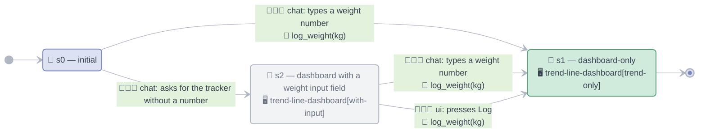

<!-- generated from manifest.yaml; do not edit -->

# weight-tracker

log daily body weight; show progress over the past week

Invoke with `/weight-tracker [kg]`.

## Interaction model



📍 state · 🖥️ UI pattern[state] · 👨🏻‍💻 user input · 🧰 agent tool use (absent = pure transition)

| state | does | UI pattern[state] | end |
|---|---|---|---|
| `s0` | initial | — |  |
| `s1` | dashboard-only | `trend-line-dashboard[trend-only]` | yes |
| `s2` | dashboard with a weight input field | `trend-line-dashboard[with-input]` |  |

| from | user input | agent tool use | to |
|---|---|---|---|
| `s0` | chat: `log_weight(kg)` — types a weight number | `log_weight(kg)` | `s1` |
| `s0` | chat: `open_tracker` — asks for the tracker without a number | — (pure) | `s2` |
| `s2` | chat: `log_weight(kg)` — types a weight number | `log_weight(kg)` | `s1` |
| `s2` | ui: `log_weight(kg)` — presses Log | `log_weight(kg)` | `s1` |

Reaching `s1` ends the machine for this invocation. The surface persists — it stays stacked above the prompt textbox and chat stays live; a later chat message starts a new run at `s0`.

## Tools

| tool | does | input | output | callable from |
|---|---|---|---|---|
| `log_weight` | append a weight entry for today | `kg: number` | `ok: bool` | `s0`, `s2` |

## Data model

| path | shape | bound by |
|---|---|---|
| `/trend/points` | [{date, kg}] — past 7 days, oldest first | `trend-line-dashboard` |
| `/trend/delta_kg` | number | `trend-line-dashboard` |
| `/trend/latest_kg` | number \| null — most recent logged weight | `trend-line-dashboard` |
| `/entry/kg` | number — two-way bound to the input field | `trend-line-dashboard` |

## UI patterns

Rendered through the `weight-tracker/v1` A2UI catalog.

### `trend-line-dashboard`

weight trend line over the past seven days

- UI states: `trend-only`, `with-input`
- used by: `s1` (`trend-line-dashboard[trend-only]`), `s2` (`trend-line-dashboard[with-input]`)
- emits: `log_weight(kg=@/entry/kg)`
- fallback: past 7 days: {@/trend/delta_kg} kg change, latest {@/trend/latest_kg} kg

```
Card #root:
  Column:
    Text #title: "past 7 days"
    LineChart #trend: points=@/trend/points
    Text #delta: "7-day change: {@/trend/delta_kg} kg"
    ?with-input Row #entry:
      NumberField #kg: value=@/entry/kg, label="kg"
      Button #log: "Log" -> event log_weight
```
